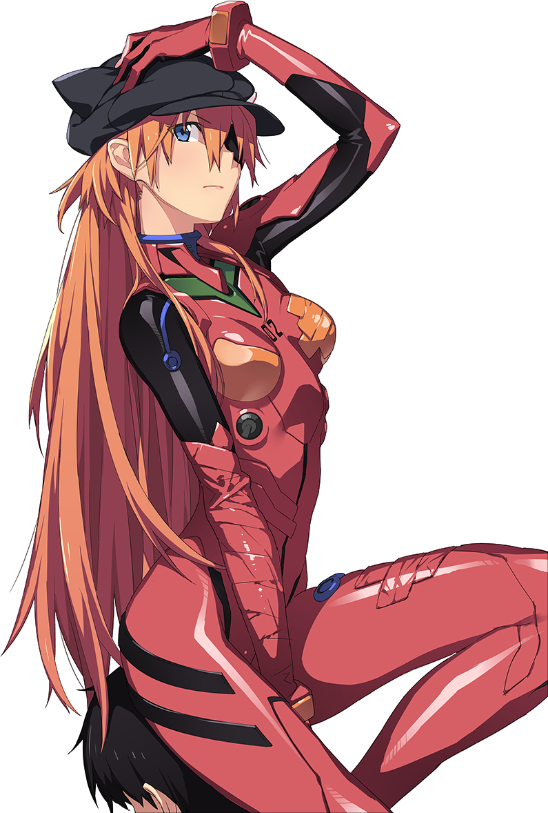

<div align="center">
<a href="https://github.com/kawarimidoll/typograssy">
    
</a>
    <p>
        
        <a href="https://t.me/manumnadal">
        </a>
    </p>

</div>


<body>
<br>
<div align="center">

</div>
<br>

<h2 align="center"> 👁️‍🗨️ About me 👁️‍🗨️ </h2>

```zsh
> neofetch
```

 

```csharp
My Profile ver. 1.0.0:
-----------------------------------------------------------------------------------
Username: Manu M. Nadal
WhoamI: Telecom Engineer. Also Minecraft modder (I try it)
OS: Ubuntu Linux
Shell: Gnome
Telegram: @manumnadal.
Pronouns: He/Him
Location: Spain
Languages: C, C++, Python, Assembler
Learning: Java
Technologies: ZigBee, Nordic's platforms, TI's platforms, FreeRTOS, Zephyr...
Loves: Videogames 🎮, Anime 📺🎥, Manga and Fantasy Books 📚📕🏹
Favs.Animes: FMA Brotherhood (of course), One Piece
Favs.Manga: Berserk
Favs.Song: I'm still standing by Elton Jhon
Favs.Videogames: Elden Ring, Minecraft, Dark Souls
Favs.Writer: Brandon Sanderson
Favs.Book: The Final Empire

```

<br>
<br>
<br>

<div>
<h2 align="center"> 🔎Knowledge📖 </h2>
</div>
<div align = "center">
<p align = "justify">I worked using Visual Studio Code for programming. Nowdays, I focus on mods development for Minecraft using Java.
So I do my best in every specialitation area. My programming languages are C/C++ and Python. Also, my knowledge languages are Spanish (Native), English (B1 ~ B2). Finally, I have own car and license.
<p align = "center">
     <a href="https://skillicons.dev">
         
    </a>
</p>
</div>
<br>
<br>
<br>
<br>
<br>
<br>

<h2 align = "center"> 📉 GitHub Stats</h2>
<div> 
<p align = "center">
    <a href="https://github-readme-stats.vercel.app">
        
    </a>
    <a href="https://github-readme-streak-stats.herokuapp.com">
        
    </a><!--change language to japanese locale=jp-->
    <a href="https://github.com/ryo-ma/github-profile-trophy">
        
        
    </a>
    <a href="https://github.com/ashutosh00710/github-readme-activity-graph">
        
    </a>
    <a href="https://github.com/vn7n24fzkq/github-profile-summary-cards">
        
</div>
<br>
<br>


<h2 align ="center"> 📝 Contact me 📝</h2>
<br> 
<div align="center">
<a href="https://github.com/manumnadal" target="_blank">

</a>
<a href="https://linkedin.com/in/manumnadal" target="_blank">

</a>  <br>
</div>  


</div>  
<br>
<div>
<h2 align="center">Thank you for reading 🙋🏻‍♂️</h2>
<div align="center">
    
  </div>
<br> 
<br>

    
<!-- <h1 align="center">Support Me 🎧🎤  </h1>

<p align="center">
⠀⠀⠀⠀⠀
</p>


<a href="https://www.buymeacoffee.com/johnkun29" target="_blank"></a>-->
